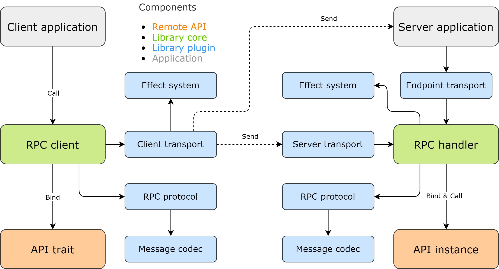

# Architecture

## Components

The library provides the following components to assemble either fully standalone RPC clients and servers or integrate with existing systems:

* [Client](https://www.javadoc.io/doc/org.automorph/automorph-core_2.13/latest/automorph/Client.html)
* [Handler](https://www.javadoc.io/doc/org.automorph/automorph-core_2.13/latest/automorph/Handler.html)
* [Effect system](https://www.javadoc.io/doc/org.automorph/automorph-spi_2.13/latest/automorph/spi/EffectSystem.html)
* [Message format](https://www.javadoc.io/doc/org.automorph/automorph-spi_2.13/latest/automorph/spi/MessageFormat.html)
* [Message transport](https://www.javadoc.io/doc/org.automorph/automorph-spi_2.13/latest/automorph/spi/MessageTransport.html)

## Diagram

## Client

The client provides automatic creation of transparent proxy instances for remote RPC endpoints defined by existing API classes. Additionally, it also
supports direct calls and notifications of remote API methods.

Depends on:

* [Effect system](https://www.javadoc.io/doc/org.automorph/automorph-spi_2.13/latest/automorph/spi/EffectSystem.html)
* [Message format](https://www.javadoc.io/doc/org.automorph/automorph-spi_2.13/latest/automorph/spi/MessageFormat.html)
* [Client message transport](https://www.javadoc.io/doc/org.automorph/automorph-spi_2.13/latest/automorph/spi/ClientMessageTransport.html)

## Handler

The handler provides automatic creation of remote RPC endpoint bindings for existing API instances and subsequent processing RPC requests.

Depends on:

* [Effect system](https://www.javadoc.io/doc/org.automorph/automorph-spi_2.13/latest/automorph/spi/EffectSystem.html)
* [Message format](https://www.javadoc.io/doc/org.automorph/automorph-spi_2.13/latest/automorph/spi/MessageFormat.html)
