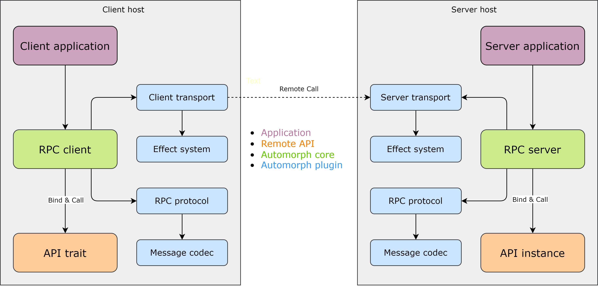
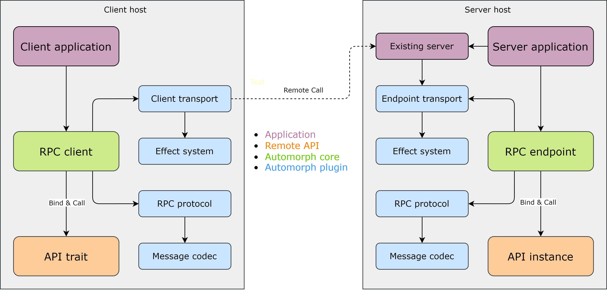

# Architecture

## Components

**Automorph** provides the following building blocks to assemble either standalone RPC clients and servers or integrate with existing systems by freely combining various plugins:

* [Client](/api/automorph/RpcClient.html)
* [Server](/api/automorph/RpcServer.html)
* [Endpoint](/api/automorph/RpcEndpoint.html)
* [RPC protocol](/api/automorph/spi/RpcProtocol.html)
* [Effect system](/api/automorph/spi/EffectSystem.html)
* [Message transport](/api/automorph/spi/MessageTransport.html)
* [Message codec](/api/automorph/spi/MessageCodec.html)

## Diagram

### Client & Server

### Client & Endpoint

## Client

Used to perform type-safe remote API calls or send one-way messages.

Remote APIs can be invoked statically using transparent proxy instances automatically derived from specified API
 traits or dynamically by supplying the required type information on invocation.

**Depends on**

* [Client message transport](/api/automorph/spi/ClientMessageTransport.html)
* [RPC protocol](/api/automorph/spi/RpcProtocol.html)

**Used by**

* Applications

## Server

Used to serve remote API requests using specific message transport protocol and invoke bound API
methods to process them.

Automatically derives remote API bindings for existing API instances.

**Depends on**

* [Server message transport](/api/automorph/spi/ServerMessageTransport.html)
* [RPC protocol](/api/automorph/spi/RpcProtocol.html)

**Used by**

* Applications

## Endpoint

Integrates with an existing message transport layer to receive remote API requests using
specific message transport protocol and invoke bound API methods to process them.

Automatically derives remote API bindings for existing API instances.

**Depends on**

* [Endpoint message transport](/api/automorph/spi/EndpointMessageTransport.html)
* [RPC protocol](/api/automorph/spi/RpcProtocol.html)

**Used by**

* Applications

## Plugins

### RPC protocol

Remote procedure call [protocol](/api/automorph/spi/RpcProtocol.html) plugin.

The underlying RPC protocol must support remote function invocation.

**Depends on**

* [Message codec](/api/automorph/spi/MessageCodec.html)

**Used by**

* [Client](/api/automorph/RpcClient.html)
* [Server](/api/automorph/RpcServer.html)
* [Endpoint](/api/automorph/RpcEndpoint.html)

### Effect system

Computational [effect system](/api/automorph/spi/EffectSystem.html) plugin.

The underlying runtime must support monadic composition of effectful values.

**Used by**

* [Client message transport](/api/automorph/spi/ClientMessageTransport.html)
* [Server message transport](/api/automorph/spi/ServerMessageTransport.html)
* [Endpoint message transport](/api/automorph/spi/EndpointMessageTransport.html)

### Message codec

Structured [message format codec](/api/automorph/spi/MessageCodec.html) plugin.

The underlying data format must support storing arbitrarily nested structures of basic data types.

**Used by**

* [RPC protocol](/api/automorph/spi/RpcProtocol.html)

### Message transport

Binary [message transport](/api/automorph/spi/MessageTransport.html) protocol plugin.

The underlying transport protocol must support request/response messaging pattern.

#### Client transport

[Client message transport](/api/automorph/spi/transport/ClientMessageTransport.html) protocol plugin.

Passively sends requests and receives responses to and from a remote endpoint using specific transport protocol.

**Depends on**

* [Effect system](/api/automorph/spi/EffectSystem.html)

**Used by**

* [Client](/api/automorph/RpcClientMessageTransport.html)

#### Server transport

[Server message transport](/api/automorph/spi/transport/ServerMessageTransport.html) protocol plugin.

Actively receives requests to be processed by the RPC handler and sends responses using specific transport protocol.

**Depends on**

* [Effect system](/api/automorph/spi/EffectSystem.html)

**Used by**

* Applications

#### Endpoint transport

[Endpoint message transport](/api/automorph/spi/transport/EndpointMessageTransport.html) protocol plugin.

Passively parses requests to be processed by the RPC handler and creates responses for specific transport protocol.

**Depends on**

* [Effect system](/api/automorph/spi/EffectSystem.html)

**Used by**

* Applications

