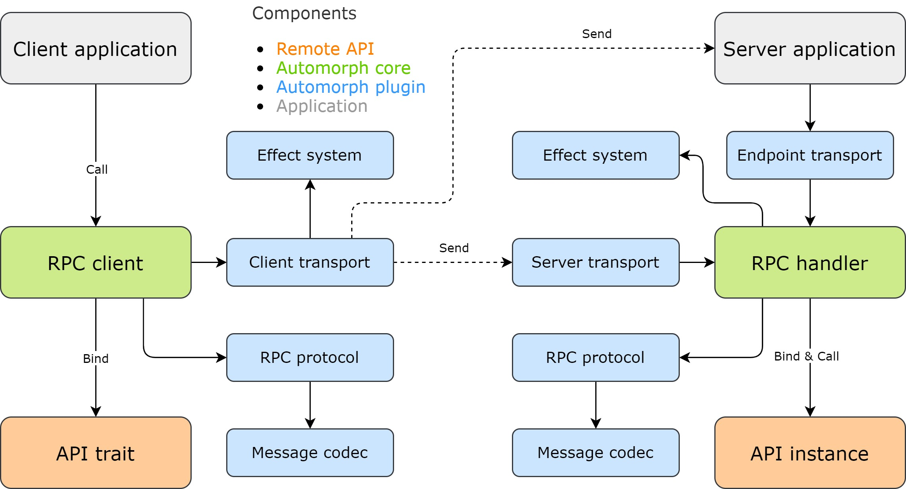

# Architecture

## Components

The library provides the following components to assemble either fully standalone RPC clients and servers or integrate with existing systems:

* [Client](https://www.javadoc.io/doc/org.automorph/automorph-core_3.0.0/latest/automorph/Client.html)
* [Handler](https://www.javadoc.io/doc/org.automorph/automorph-core_3.0.0/latest/automorph/Handler.html)
* [RPC protocol](https://www.javadoc.io/doc/org.automorph/automorph-spi_3.0.0/latest/automorph/spi/RpcProtocol.html)
* [Effect system](https://www.javadoc.io/doc/org.automorph/automorph-spi_3.0.0/latest/automorph/spi/EffectSystem.html)
* [Message transport](https://www.javadoc.io/doc/org.automorph/automorph-spi_3.0.0/latest/automorph/spi/MessageTransport.html)
* [Message codec](https://www.javadoc.io/doc/org.automorph/automorph-spi_3.0.0/latest/automorph/spi/MessageCodec.html)

## Diagram

## Client

The client provides automatic creation of transparent proxy instances for remote RPC endpoints defined by existing API classes. Additionally, it also
supports direct calls and notifications of remote API functions.

**Depends on**

* [Effect system](https://www.javadoc.io/doc/org.automorph/automorph-spi_3.0.0/latest/automorph/spi/EffectSystem.html)
* [RPC protocol](https://www.javadoc.io/doc/org.automorph/automorph-spi_3.0.0/latest/automorph/spi/RpcProtocol.html)
* [Message codec](https://www.javadoc.io/doc/org.automorph/automorph-spi_3.0.0/latest/automorph/spi/MessageCodec.html)
* [Client message transport](https://www.javadoc.io/doc/org.automorph/automorph-spi_3.0.0/latest/automorph/spi/ClientMessageTransport.html)

**Used by**

* Applications

## Handler

The handler provides automatic creation of remote RPC endpoint bindings for existing API instances and subsequent processing RPC requests.

**Depends on**

* [RPC protocol](https://www.javadoc.io/doc/org.automorph/automorph-spi_3.0.0/latest/automorph/spi/RpcProtocol.html)
* [Message codec](https://www.javadoc.io/doc/org.automorph/automorph-spi_3.0.0/latest/automorph/spi/MessageCodec.html)
* [Effect system](https://www.javadoc.io/doc/org.automorph/automorph-spi_3.0.0/latest/automorph/spi/EffectSystem.html)

**Used by**

* [Server message transport](https://www.javadoc.io/doc/org.automorph/automorph-spi_3.0.0/latest/automorph/spi/transport/ServerMessageTransport.html)
* [Endpoint message transport](https://www.javadoc.io/doc/org.automorph/automorph-spi_3.0.0/latest/automorph/spi/transport/EndpointMessageTransport.html)
